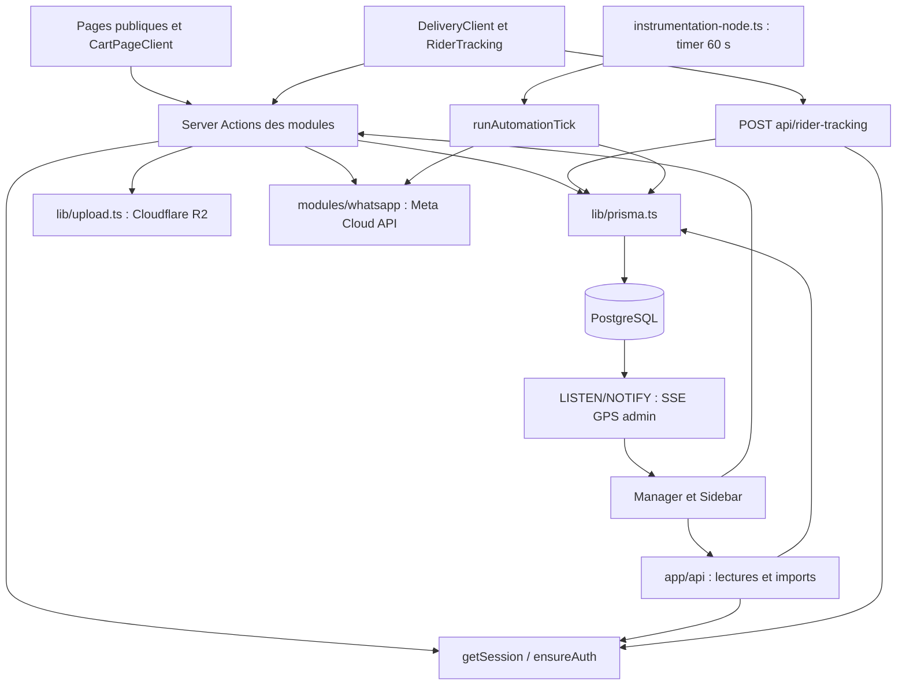
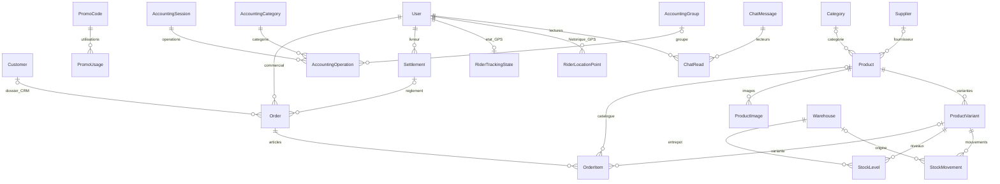
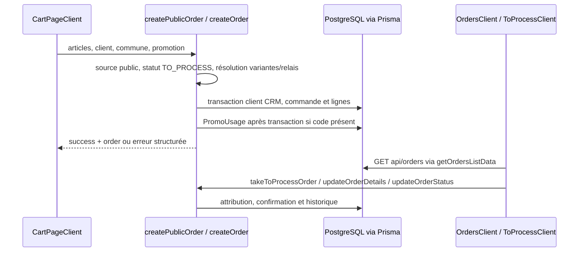
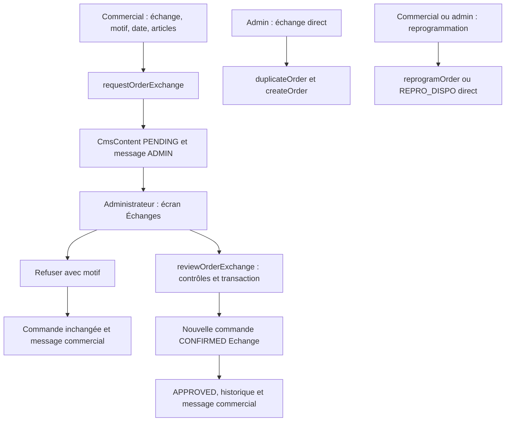
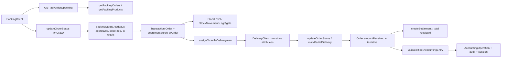

# Cartographie du projet ZangoChap Gest

Personnel de toute l’équipe (2026-09-22) : `modules/personnel/` contient schéma, formulaire, actions et normalisation des justificatifs privés. Entrée depuis l’équipe vers `app/zangochap-manager/admin/settings/team/[userId]/page.tsx`. Deux tables Prisma dédiées (fiche et documents binaires), accès admin/développeur, aucune URL R2 publique. Migration SQL préparée mais non appliquée ; voir `docs/RIDER_PERSONNEL.md` pour activation, limites et tests.

Rappel commercial du 2026-09-20 : `modules/orders/components/ExchangePendingReminder.tsx` est monté dans le layout manager hors zone défilante, uniquement pour le commercial. Carte flottante réductible, sans fermeture définitive ; compteur via `GET /api/order-exchange-reminder` (session obligatoire, filtre propriétaire/PENDING côté serveur, count uniquement, cache interdit). Actualisation 20 s, navigation, focus, retour en ligne/visibilité et événement `order-exchange-requested` émis par `OrdersClient` après soumission. Styles dans `exchange-reminder.css`, test isolé `scripts/test-exchange-reminder.mjs`.

Audit ciblé du 2026-09-18 : `docs/EXCHANGES_AUDIT.md` détaille la page des demandes d’échange, ses restrictions, risques et vérifications.

Échanges, complément du 2026-09-18 : `getExchangeRequests` retourne `{ requests, invalidCount }` après validation structurelle ; `getExchangeRequestsForUi` est la façade de chargement de la page. `reviewOrderExchangeForUi` accepte une correction optionnelle date/adresse, contrôlée par `ExchangeCorrectionSchema` et historisée dans la demande au commit. `modules/orders/helpers/exchange-diagnostics.ts` produit les références techniques sans données client. Pas de changement de schéma SQL.

Dernière vérification ciblée : 2026-09-17, échanges avec approbation et reprogrammation directe ; cartographie générale vérifiée le 2026-09-16. **Présent dans le code** ne signifie ni déployé, ni validé en production. Voir `docs/PROGRESS.md` pour les vérifications. Le code et `prisma/schema.prisma` priment sur ce document.

## Fonctionnement et stack

Application de vente de mode et d'exploitation : boutique publique, back-office multi-rôles, espace livreur et points relais. Le code couvre catalogue/variantes, panier, commandes web et staff, attribution commerciale, cadeaux et promotions, préparation, collecte des articles manquants, contrôle, stock multi-entrepôts, livraison, dépôts d'expédition, règlements, comptabilité, CRM, médias, CMS, messagerie, notes et automatisations WhatsApp.

Monolithe Next.js App Router : pages serveur, composants clients et Server Actions, avec handlers HTTP pour rafraîchissement, imports, webhooks et GPS. Il n'existe pas de serveur API séparé dans ce dépôt. PostgreSQL via Prisma et adaptateur `pg` ; pool et singleton dans `lib/prisma.ts`.

Versions déclarées dans `package.json` : Next **15.2.1**, React **19.0.0**, Prisma **^7.8.0**, TypeScript **^6**. UI : TanStack Query, Lucide, Framer Motion, Tailwind 4, Base UI/shadcn et CSS classique/modules. Auth : jose/bcryptjs ; validation Zod partielle. Médias : SDK S3 et Sharp. Cartographie : Leaflet. Exports/imports : xlsx, docx, file-saver. `package-lock.json` versionne la résolution npm ; les dépendances n'ont pas été installées pendant l'analyse.

## Arborescence utile

```text
app/                         Routes, chargements serveur et nombreux écrans clients encore locaux
  api/                       Handlers HTTP (voir inventaire ci-dessous)
  shop/, search/, product/   Catalogue public ; product/[id] accepte ID ou slug
  cart/, compte/             Checkout et inscription/connexion client
  zangochap-manager/         Connexion staff à la racine, puis outils métier
  zangochap-rider/           Missions, historique, caisse, profil et suivi GPS
modules/                     Domaines métier ; structure mixte plate/actions/components
components/                  Sidebar, Providers, modales, alertes et UI transverses
  public/                    PublicLayout, Navbar, ProductCard et popups publics
  ui/                        Primitives de formulaire et dialogue
lib/                         Prisma, auth, upload, panier, SEO et utilitaires partagés
prisma/                      schema.prisma, seed.ts et SQL manuels
  manual-migrations/         Évolutions comptabilité, chat, cadeaux, dépôts, packing et GPS
scripts/                     Tests isolés, imports et maintenance potentiellement mutante
docs/                        Cette carte, journal et diagnostic technique antérieur
memory/                      Contexte et journal historiques ; ne pas supposer leur actualité
public/                      Assets et répertoire uploads prévu au déploiement
```

`scratch/`, sauvegardes, uploads, caches, builds et dépendances sont hors analyse de contenu. `AGENT.md` contient des consignes existantes de production/mémoire ; `AGENTS.md` fournit désormais le repère de reprise sans remplacer ces consignes.

## Architecture



Les actions utilisent les sessions côté serveur ; ce schéma représente l'intention générale, **pas une garantie de contrôle pour toutes les actions** (écarts connus ci-dessous).

## Surfaces et modules : où intervenir

| Domaine | Pages ou écrans | Fichiers métier et rôle |
| --- | --- | --- |
| Boutique | `app/page.tsx`, `app/HomeClient.tsx`, `app/shop/page.tsx`, `app/shop/ShopClient.tsx`, `app/search/SearchClient.tsx`, `app/product/[id]/page.tsx` | `modules/products/actions/index.ts` expose `getProducts`, `getProductById` ; fiche active : `app/product/[id]/ProductDetailClient.tsx`. `lib/seo.ts`, `app/sitemap.ts`, `app/robots.ts` pour référencement. |
| Checkout | `app/cart/page.tsx`, `app/cart/cart-page-client.tsx` (`CartPageClient`) | `lib/CartContext.tsx` (`CartProvider`, `useCart`) persiste le panier en localStorage ; `createPublicOrder` dans `modules/orders/actions/order-actions.ts`. |
| Commandes | `app/zangochap-manager/orders/` : liste, `new`, `to-process`, `non-packed`, `trash` | `modules/orders/components/OrdersClient.tsx`, `NewOrderClient.tsx`, `ToProcessClient.tsx`, `NonPackedClient.tsx`. Façade `modules/orders/actions/index.ts` → `actions.ts` → implémentations spécialisées. `queries.ts` : `buildOrdersWhere`, `getOrdersListData`, pagination 50. `order-actions.ts` : CRUD, attribution, duplication/reprogrammation. `trash-actions.ts` : corbeille. |
| Produits | `app/zangochap-manager/products/` : liste, `new`, `[id]/edit`, `shortages` | `modules/products/components/ProductForm.tsx`, `ProductsClient.tsx` ; `modules/products/actions/actions.ts` implémente CRUD, variantes, stocks et promotions. |
| Logistique | `app/zangochap-manager/logistics/` : `packing`, `collection`, `verification`, `verification/print`, `labels`, `warehouses` | `modules/logistics/packing/PackingClient.tsx`, `data.ts`, `queries.ts` ; `collection/actions.ts`, `CollectionClient.tsx` ; `verification/actions.ts` (`toggleItemVerification`), `VerificationClient.tsx` ; `labels/actions.ts`, `LabelsClient.tsx`. `modules/logistics/actions.ts` est une façade de compatibilité. |
| Inventaire | `app/zangochap-manager/inventory/`, `inventory/history/` | `modules/logistics/warehouses.ts` façade de `warehouseActions.ts` ; `transferStock`, `adjustStock` délèguent à `modules/orders/actions/stock.ts`. `lib/stock-sync.ts` contient la synchronisation des agrégats. |
| Livraison | `app/zangochap-manager/admin/delivery/` et sous-routes `corrections`, `settlement` ; `admin/delivery-sheet/` | `modules/orders/actions/delivery-actions.ts` : `assignOrderToDeliveryman`, `bulkAssignOrders`, `autoAssignDeliveryOrders`. `status-actions.ts` : `updateOrderStatus`, `markPartialDelivery`, `reopenDeliveryOrder`. |
| Livreur | `app/zangochap-rider/page.tsx`, `app/zangochap-rider/DeliveryClient.tsx` | `app/zangochap-rider/components/OrderDetailsSheet.tsx`, `app/zangochap-rider/components/WalletView.tsx`, `app/zangochap-rider/components/ProfileView.tsx`, `app/zangochap-rider/components/RiderHistory.tsx` ; `app/zangochap-rider/history-actions.ts` pour recherche/pagination serveur. Chargements des missions attribuées, historique récent plafonné à 300, encaissements non réglés chargés indépendamment. |
| GPS | `app/zangochap-manager/admin/rider-map/` : `RiderMapClient.tsx`, `TrackingMap.tsx`, `use-tracking-stream.ts`, `ViewerPositionPanel.tsx` | `app/zangochap-rider/components/RiderTracking.tsx`, `use-screen-awake.ts` ; `modules/rider-tracking/validation.ts`, `segments.ts`, `types.ts`, `viewer-position.ts`. Position administrateur conservée localement ; recherche de lieu via API Geoapify. |
| Points relais | `app/zangochap-manager/boutique/page.tsx`, `BoutiqueRelayClient.tsx` | `modules/boutique/relay-queries.ts`, `relay-actions.ts` : dépôt, retrait, annulation ; `depositRelayParcelAction`, `markRelayParcelPickedUpAction`, `cancelRelayParcelAction`. |
| Règlements et reporting | `admin/settlements/`, `admin/expeditions/deposits/`, `admin/performance/`, `admin/top-products/`, `dashboard/` sous `app/zangochap-manager/` | `settlement-actions.ts` : `createSettlement`, `getPendingSettlements`, statistiques ; `analytics-actions.ts`, `sidebar-counts.ts`. `modules/expedition-deposits/actions.ts` : `reviewExpeditionDeposit`, correction et acquittement d'alerte. Dashboards distincts par métier. |
| Comptabilité | `app/zangochap-manager/accounting/` : espace, `sessions/[id]`, `sessions/by-date/[date]`, `bilan` | `modules/accounting/actions.ts` : `getAccountingWorkspace`, `validateRiderAccountingEntry`, `createAccountingOperation`, `closeAccountingSession`, `reopenAccountingSession`, `getAccountingBilan`. Sessions, catégories, groupes, rapports et audits. |
| Auth/équipe | `app/zangochap-manager/LoginClient.tsx`, `admin/settings/team/`, `admin/team/`, `app/compte/page.tsx` | `modules/auth/actions.ts` : `loginAction`, `getSession`, `createAccount` ; `customer-actions.ts` : `registerCustomer`, `loginCustomer`. `lib/auth.ts`, `lib/staff-route-guard.ts`, `middleware.ts`, `proxy.ts`. |
| Paramétrage/cadeaux | `app/zangochap-manager/admin/settings/` : catégories, fournisseurs, communes, promotions, cadeaux | `modules/settings/actions.ts` CRUD référentiels ; `modules/gifts/actions.ts` : quotas et `reviewGiftRequest`. Promotions également dans `admin/promos/` et `marketing/` : `modules/marketing/actions.ts`, `lib/promo-engine.ts`. |
| CRM | `app/zangochap-manager/admin/crm/`, `directory/` | `modules/crm/actions.ts` : `getCustomers`, `upsertCustomerFromOrder` ; `admin-actions.ts` façade de `admin_actions.ts`. |
| CMS/médias | `app/zangochap-manager/admin/cms/`, `media/` | `modules/cms/actions.ts` : `getHomeCmsContent`, `saveHomeCmsContent` ; `types.ts` normalise les blocs. `modules/media/actions.ts` : `getMediaFiles`, upload/suppression ; `lib/upload.ts` (`uploadImage`) transforme les images avec Sharp puis R2. |
| Communication | `app/zangochap-manager/chat/`, `admin/whatsapp/`, `admin/automations/` | `modules/chat/actions.ts` : `getChatSnapshot`, `sendChatMessage`, rapports commerciaux et alertes. `modules/notes/actions.ts` : notes privées staff dans CmsContent. `modules/whatsapp/config.ts`, `send.ts` (`graphFetch`), `order-actions.ts`, `marketing-actions.ts`, `message-builder.ts`. `modules/automations/actions.ts`, `engine.ts`, `types.ts` : règles, file différée et déclencheurs. |
| Développeur | `app/zangochap-manager/developer/logs/` | `modules/developer/actions.ts` diagnostics/export/outils mutateurs ; `backup-actions.ts` sauvegarde, simulation et restauration ; `audit.ts` (`recordDeveloperAudit`). Accès et effets à relire avant tout usage. |

Dans la ligne reporting, les chemins courts de pages sont relatifs à `app/zangochap-manager/`, et les fichiers d'actions à `modules/orders/actions/`. Les noms de fichiers abrégés dans les autres lignes désignent les fichiers voisins du chemin complet indiqué dans la même cellule.

## API HTTP existantes

Chaque URL ci-dessous correspond exactement à `app` + URL + `/route.ts`.

| URL | Méthodes | Responsabilité / contrôle observé |
| --- | --- | --- |
| `/api/orders` | GET | Session ; filtres/pagination via `getOrdersListData`. |
| `/api/orders/to-process`, `/api/orders/non-packed` | GET | Files de commandes, chargement métier. |
| `/api/orders/packing` | GET | Session et `assertPackingAccess` ; préparation et produits associés. |
| `/api/products/search` | GET | Recherche staff authentifiée, sélection de produits. |
| `/api/sidebar-counts` | GET | Compteurs adaptés à la session. |
| `/api/delivery-sheet` | GET | Feuille de livraison ; vérification de session. |
| `/api/expedition-deposit-alerts` | GET | Alertes commerciales via module dépôts. |
| `/api/promos` | POST, PATCH, DELETE | Administration promotions, rôle admin/developer ; pas de GET. |
| `/api/import` | POST | Admin/developer ; `type=products` ou `orders`, 1 à 1 000 lignes et bilan d'erreurs. |
| `/api/public/cms` | GET | Contenu public normalisé. |
| `/api/chat/snapshot` | GET | Snapshot via module chat. |
| `/api/chat/rider-alerts/stream` | GET | SSE authentifié d'alertes ; événements en mémoire via `lib/rider-alert-events.ts`. |
| `/api/rider-tracking` | POST | start/point/stop ; rôle livreur, origine validée, identité dérivée du serveur. |
| `/api/admin/rider-tracking` | GET | Admin/developer, live/history, filtres UTC et 1 à 5 livreurs. |
| `/api/admin/rider-tracking/stream` | GET | SSE admin/developer, LISTEN PostgreSQL, connexion dédiée. |
| `/api/admin/rider-tracking/place` | GET | Admin/developer, géocodage inverse serveur, cache/limitation mémoire. |
| `/api/webhooks/whatsapp` | GET, POST | Challenge de vérification Meta ; POST signé HMAC, journal et traitement webhook. |

Les APIs sont exclues de la garde middleware : leur handler ou module appelé doit assurer les droits. L'existence des contrôles ne constitue pas un audit complet des permissions.

## Données et relations

Source : `prisma/schema.prisma`. `User` représente comptes staff **et** CUSTOMER ; `Customer` est un dossier CRM distinct, sans relation Prisma à User. Commande liée au CRM et au commercial ; son `deliverymanId` est une chaîne, sans relation déclarée à User. `Settlement` relie effectivement User et commandes. Les lignes conservent nom/prix/variantes comme données de commande et peuvent être personnalisées sans produit.



Autres structures : SubCategory liée à Category/Product ; promotions reliées en plusieurs-à-plusieurs à Product/Category ; rapports comptables reliés aux sessions/catégories ; audits comptables et développeur ; messages avec expéditeur/destinataire/rôle ; `CmsContent` stocke du JSON par clé (CMS, notes, réglages, règles/file/logs d'automatisation et WhatsApp).

**Ne pas inventer de clés étrangères** : `StockMovement.orderId`, `CollectionRecord.orderId/productId`, `GiftApprovalRequest.orderId/orderItemId/commercialId`, `AccountingOperation.deliveryOrderId/customerId/riderId` et `PromoUsage.orderId` sont des identifiants scalaires sans relations Prisma déclarées. `PromoUsage.orderId` est unique ; `AccountingOperation` a une unicité `[source, deliveryOrderId]`.

Montants principalement `Int`, mais prix Product en Decimal et `PromoUsage.orderTotal` en Float. `Order.total`, `discount`, `deliveryFee`, `amountReceived` sont distincts : examiner les calculs du parcours concerné avant toute modification. Historiques métier souvent JSON ; `deliveredAt` est une chaîne tandis que les autres dates principales sont DateTime. Soft delete des commandes par `deletedAt`.

## Parcours suivis dans le code

### Achat et traitement commercial



La fiche `app/product/[id]/page.tsx` charge un produit PUBLISHED par ID/slug et monte `ProductDetailClient`. Panier dans `lib/CartContext.tsx` ; checkout appelle directement une Server Action, pas un POST `/api/orders`. Les actions de remise sont exposées par `modules/products/actions/index.ts` et utilisent `lib/promo-engine.ts`. Création publique et staff convergent ; notifications WhatsApp des commandes CONFIRMED et `triggerAutomations` s'exécutent après création. Une utilisation promo est enregistrée après transaction avec erreur journalisée sans annuler la commande.

**Écart vérifié** : le service interne appelé par `createOrder` calcule les lignes mais privilégie `data.total` lorsqu'il est fourni ; prix/quantités/remise/frais proviennent encore du payload. Le recalcul intégral à partir des données faisant autorité n'est pas garanti par ce parcours. Depuis le 2026-09-17, ces calculs sont dans `modules/orders/actions/order-creation-service.ts`.

### Échanges avec validation administrateur (2026-09-17)

Interface : `modules/orders/components/ExchangeRequestsClient.tsx` utilise `modules/orders/components/exchanges.css` (styles dédiés, responsive), filtres avec compteurs, recherche locale et cartes avec détails repliables et zone décision. Les styles historiques `reprogramming.css` restent réservés à l’ancien écran.

Envoi depuis `OrdersClient.tsx` : façade `duplicateOrderForUi` dans `modules/orders/actions/index.ts`, enveloppe succès/échec pour afficher les validations attendues en production. `requestOrderExchange` nomme le champ/article invalide sans retourner de données sensibles ; échec conserve le formulaire ouvert. `duplicateOrder` reste disponible pour les autres appels.

Décision admin depuis `ExchangeRequestsClient.tsx` : `reviewOrderExchangeForUi` retourne également les erreurs attendues en données (notamment date devenue passée ou original modifié). `reviewOrderExchange` conserve les contrôles et la transaction ; une approbation échouée laisse la demande en attente sans créer de commande.

- Périmètre corrigé après confirmation du propriétaire : validation pour les échanges commerciaux ; reprogrammation et REPRO_DISPO directs pour les utilisateurs autorisés, avec protections de livraison clôturée/règlement conservées.
- Route : app/zangochap-manager/orders/exchanges/page.tsx ; écran modules/orders/components/ExchangeRequestsClient.tsx ; navigation « Mes échanges / Échanges » dans components/Sidebar.tsx et compteur exchangePending dans modules/orders/actions/sidebar-counts.ts.
- duplicateOrder (modules/orders/actions/order-actions.ts) vérifie accès/rôle et transmet Echange commercial à requestOrderExchange (modules/orders/actions/exchange-actions.ts). ExchangeOrderSchema (modules/orders/types/exchange.ts) valide date, motif exchangeReason, contenu et paiement. Demande dans CmsContent order-exchange:<uuid> et message ROLE ADMIN, sans création de commande/CRM/stock.
- getExchangeRequests filtre le commercial sur ses demandes ; admin/developer voient toutes les demandes. reviewOrderExchange verrouille demande/original, vérifie version et propriétaire, puis crée une commande CONFIRMED Echange attribuée au demandeur, avec confirmation admin, historique original et retour privé. Refus motivé sans création. Même décision répétée idempotente ; une demande à la fois par commande ; nouvelle demande possible après traitement. Demande obsolète à refuser puis refaire.
- createOrderWithContext (modules/orders/actions/order-creation-service.ts), interne sans use server, intègre commande/CRM/décision en transaction ; WhatsApp/automatisations après commit. Quotas cadeaux conservés. Références ECHANGE et collisions résolues via generateUniqueRef ; uploads R2 normalisés avant transaction après contrôle d'appartenance. Images après refus potentiellement inutilisées ; demandes sans pagination/purge.
- Admin/developer créent directement un échange. Commercial : création directe/conversion vers Echange bloquées côté serveur. Modal fixe le type et expose les paiements préremplis depuis l'original et modifiables. Paiement hors Abidjan obligatoire, y compris dès la demande. Antidoublon d'expédition exempté uniquement pour échanges staff autorisés ; commandes ordinaires/publiques toujours contrôlées.
- Historique conservé à app/zangochap-manager/orders/reprogramming/page.tsx pour CmsContent order-reprogramming:<uuid> : consultation/refus motivé, nouvelle demande et approbation désactivées dans reprogramming-actions.ts. Aucune conversion automatique ni suppression.
- Test : node scripts/test-order-exchanges.mjs, actions/service réels avec Prisma simulé (droits, attente, décisions, rollback, concurrence simulée, références/médias/cadeaux, reprogrammation et REPRO_DISPO directs, expédition échange autorisée / antidoublon ordinaire maintenu). Ancien test-order-reprogramming.mjs appelle cette suite pour compatibilité. PostgreSQL réel/UI authentifiée non vérifiés.



### Préparation, livraison, règlement et comptabilité



Ce diagramme décrit des étapes usuelles, **pas une machine à états exhaustive**, ni une synchronisation automatique règlement/comptabilité. `OrderItem.packingStatus` est indépendant de `isVerified/verifiedAt` : `toggleItemVerification` traite le contrôle séparément. Le passage PACKED décrémente le stock dans la transaction ; `stock.ts` contient décrément, restauration, transfert et ajustement. Blocage des expéditions avec état de dépôt non RECEIVED et des cadeaux non approuvés. Certaines sorties d'états d'expédition restaurent le stock. Livraison partielle transforme les lignes et restaure les quantités non livrées : relire `markPartialDelivery` avant correction.

`createSettlement` recalcule les montants collectés et ventile frais/produits ; les retraits encaissés en boutique sont exclus des sommes à régler par livreur. Les commandes déjà liées à un settlement ne peuvent pas être rouvertes par `reopenDeliveryOrder`. Comptabilité : `validateRiderAccountingEntry` crée/actualise les écritures de livraison et audits ; sessions clôturables, réouverture réservée admin/developer. Aucun test de bout en bout réel de ce parcours pendant cette session.

### GPS et carte administrateur

`RiderTracking` utilise watchPosition ; démarrage automatique sous réserve de permission navigateur, arrêt manuel mémorisé pour l'onglet. POST `/api/rider-tracking` valide session/origine/coordonnées/date/token et écrit RiderTrackingState/RiderLocationPoint en transaction avec signal `pg_notify` après commit. Cadence serveur limitée, ID de point unique, ancien appareil neutralisé. `use-tracking-stream.ts` reçoit SSE puis recharge le snapshot protégé ; polling de secours. Historique plafonné à 10 000 points en mono, 2 000/personne en comparaison jusqu'à 5 ; `segments.ts` sépare sessions et interruptions.

Le géocodage de lieu est déclenché au clic via `/api/admin/rider-tracking/place`, avec Geoapify côté serveur. Wake Lock optionnel dans `use-screen-awake.ts`. Aucun suivi permanent garanti en arrière-plan. La présence réelle des tables et la conservation souhaitée des positions restent à confirmer sans migration automatique.

## Authentification, droits et intégrations

- Staff : `loginAction`, bcrypt, JWT HS256 7 jours, cookie `zc_session` HTTP-only/SameSite lax/secure en production ; redirection selon rôle. `getSession` vérifie le JWT puis recharge User, avec repli par email pour sessions anciennes. Les rôles retournés sont minuscules, les enums Prisma majuscules.
- `ensureAuth(roles)` autorise implicitement developer. `checkOrderAccess` et `isRole` dans `modules/orders/helpers/index.ts` sont utilisés pour les commandes. Sidebar masque des entrées, mais ne remplace pas les contrôles serveur.
- Rôles définis : DEVELOPER, ADMIN, COMPTABLE, COMMERCIAL, PACKING, COLLECTION, STOCK, POINT_RELAIS, CUSTOMER, LIVREUR. Comptabilité : admin/developer/comptable ; carte GPS : admin/developer ; GPS émetteur : livreur ; CRM utilise une liste de rôles staff explicite ; notes : admin/commercial avec privilège developer hérité.
- Compte client : inscription/connexion bcrypt, cookie `zc_customer` contenant **un ID non signé**, sans secure/sameSite explicites dans `customer-actions.ts`. Aucun lien User CUSTOMER ↔ Customer CRM établi dans le schéma ; intégration complète compte/historique d'achat non démontrée.
- `middleware.ts` et `proxy.ts` appellent `guardStaffRoutes` : signature JWT aux routes staff/rider, API exclues. La garde ne recharge pas User et ne vérifie pas chaque rôle ; les pages/actions restent responsables de l'autorité métier.
- R2 : variables `R2_ACCOUNT_ID`, `R2_ACCESS_KEY_ID`, `R2_SECRET_ACCESS_KEY`, `R2_BUCKET_NAME`, `R2_PUBLIC_URL`. Sharp réduit les images, WebP par défaut/JPEG pour WhatsApp. Volume local uploads conservé par Docker ; ne pas supposer qu'il remplace R2.
- Meta WhatsApp : variables `WHATSAPP_*` définies dans `modules/whatsapp/config.ts` et `.env.example` ; webhook signé, logs/config dans CmsContent. Aucun envoi réel vérifié. Automatisations : timer Node chaque minute dans `instrumentation-node.ts`, `runAutomationTick` traite file et règles planifiées ; guard anti-chevauchement local au processus.
- Geoapify : `GEOAPIFY_API_KEY` ; positions transmises au service au clic. Leaflet utilise les tuiles OpenStreetMap. Position administrateur locale ; liaison dessinée à vol d'oiseau, pas routage.
- `app/layout.tsx` intègre GoogleAnalytics et Pixel Facebook conditionnellement au CMS. `scripts/import-wix.ts` et images Wix : import/compatibilité assets ; pas preuve de synchronisation Wix continue. Providers globaux : TanStack Query, panier, toast.

## Commandes, tests et déploiement

Exécuter depuis la racine. Sous PowerShell, `npm.cmd`/`npx.cmd` évitent les problèmes de politique des scripts `.ps1`.

| Commande existante | Usage et portée |
| --- | --- |
| `npm ci` | Installation selon lock ; postinstall génère Prisma. Non exécutée ici. |
| `npm run dev` | `prisma generate && next dev`. |
| `npm run build` | `prisma generate && next build` ; vérification TS, lint désactivé pendant build. |
| `npm start` | `next start` après build local. |
| `npm run lint` | ESLint global, dette historique rapportée dans memory, non revalidée ici. |
| `npx tsc --noEmit --incremental false` | Contrôle TS sans cache incrémental ; dépendances/client Prisma nécessaires. |
| `node scripts/test-expedition-day.cjs` | Helpers du jour d'expédition, bornes et trois fuseaux, aucun accès DB. |
| `node scripts/test-rider-history.mjs` | Historique avec Prisma simulé : droits, périodes, pagination. |
| `node scripts/test-rider-tracking.mjs` | Routes GPS simulées, validation, droits, sessions, cadence, filtres et segments. |
| `node scripts/test-rider-stream.mjs` | SSE et PostgreSQL simulés, session, notifications et cycle de connexion. |
| `node scripts/test-rider-place.mjs` | Géocodage simulé, autorisation, validation, cache ; aucun appel Geoapify réel. |
| `npm run stock:audit` | `repair-stock.ts` sans option mutante ; lire sa cible avant exécution. |
| `npm run stock:fix-negatives`, `npm run stock:merge-defaults`, `npm run stock:sync` | Réparations avec écriture ; pas des tests, accord préalable selon AGENT.md. |

Pas de script npm `test` ni framework de test général déclaré. Le 2026-09-16, les cinq tests ne pouvaient pas démarrer faute de dépendances. Le 2026-09-17, installation selon lock et génération Prisma locale avec URL factice sans connexion DB : TypeScript, ces cinq tests et le nouveau `node scripts/test-order-reprogramming.mjs` passent. Lint des nouveaux fichiers passe ; lint global encore en échec historique (résultats dans le journal). Build et UI authentifiée non vérifiés.

Docker : `Dockerfile` multistage Node 20 Alpine, npm ci, build Next standalone, utilisateur nextjs, `node server.js`, port 3000. `docker-compose.yml` : variables DATABASE_URL/JWT_SECRET obligatoires, volume uploads, réseau externe `dokploy-network`, healthcheck HTTP `/`. Procédure dérivée de la configuration : préparer le réseau/environnement, construire puis démarrer avec `docker compose build` et `docker compose up -d` ; **non testée ici**, routage HTTPS/proxy à confirmer dans l'hébergement. Le script `scripts/start-prod.sh` vérifie DATABASE_URL et lance server.js, mais le Dockerfile ne l'appelle pas. Aucun serveur PostgreSQL fourni par Compose. Aucun changement de schéma au démarrage.

Prisma : configuration dans `prisma.config.ts`, génération via scripts npm, SQL manuels dans `prisma/manual-migrations/` et `prisma/add-point-relais-role.sql`. Pas de dossier de migrations Prisma versionnées standard présent. Seed déclaré avec `npx tsx prisma/seed.ts`, mais tsx n'est pas déclaré comme dépendance directe. Toute migration/seed/réparation exige le respect des consignes de production de `AGENT.md` ; aucune de ces opérations effectuée ici.

## Je veux modifier…

### Réception durable des alertes livreur (vérifié le 2026-09-17)

`sendOrderSupportAlert` (`modules/chat/actions.ts`) enregistre un ChatMessage DIRECT au commercial attribué, ou ROLE COMMERCIAL si absent/en pause, puis émet un événement SSE local. `components/Sidebar.tsx` affiche les alertes via SSE et récupère indépendamment les messages persistés avec `getUnreadRiderAlerts`, toutes les 8 secondes et au focus/retour réseau. Le rattrapage vérifie session, visibilité, non-lus et marqueur `[ALERTE LIVREUR]` ; lots de 50, curseur date/id, exclusion des alertes ROLE COMMERCIAL pour les utilisateurs actuellement en pause. Il ne marque pas les messages comme lus : cette responsabilité reste au chat. `lib/client-alerts.ts` dédoublonne SSE/rattrapage via sessionStorage et mémoire en cas de stockage bloqué. La page chat gère ses alertes elle-même.

Test isolé : `node scripts/test-rider-alerts.mjs` (actions/filtres et stockage bloqué simulés). Vérifier également la réception authentifiée après déploiement avec SSE interrompu. Le SSE seul reste non distribué ; le rattrapage vient de PostgreSQL via Prisma et fonctionne indépendamment des événements locaux.

Contrôles communs après modification de code : TypeScript et lint ci-dessus. « Manuel » signifie qu'aucun test automatisé de ce parcours n'a été identifié ; utiliser un environnement de test, pas la production.

| Je veux modifier… | Fichiers à consulter | Dépendances à considérer | Tests à lancer |
| --- | --- | --- | --- |
| Catalogue/fiche produit | `app/product/[id]/page.tsx`, `app/product/[id]/ProductDetailClient.tsx`, `modules/products/actions/actions.ts` | Product/variants/images, panier, SEO, CMS | TS/lint ; manuel catalogue, variante, rupture |
| Panier/checkout/remise | `app/cart/cart-page-client.tsx`, `lib/CartContext.tsx`, `modules/orders/actions/order-actions.ts`, `lib/promo-engine.ts` | CRM, communes, PromoUsage, relais, R2 | TS/lint ; manuel prix/remise/frais, web TO_PROCESS |
| File commandes/attribution | `modules/orders/components/OrdersClient.tsx`, `modules/orders/actions/queries.ts`, `modules/orders/actions/order-actions.ts` | Session, filtres API, round-robin CMS, pause commerciale | TS/lint ; manuel rôles et pagination |
| Packing/contrôle/collecte | `modules/logistics/packing/PackingClient.tsx`, `modules/logistics/verification/actions.ts`, `modules/logistics/collection/actions.ts`, `modules/orders/actions/status-actions.ts` | Cadeaux, dépôts, stock, séparation packing/verification | TS/lint ; `node scripts/test-expedition-day.cjs` ; manuel articles manquants |
| Stocks/entrepôts | `modules/orders/actions/stock.ts`, `modules/logistics/warehouseActions.ts`, `lib/stock-sync.ts` | StockLevel, agrégats, mouvements, retours, transactions | TS/lint ; manuel transfert et restauration sur base test ; audit seul après revue cible |
| Livraison/partiel/reprogrammation | `app/zangochap-rider/DeliveryClient.tsx`, `modules/orders/actions/status-actions.ts`, `modules/orders/actions/delivery-actions.ts` | Attribution, motif/date, stock, settlement, boutique | TS/lint ; test-rider-history ; manuel partiel/retour |
| Demandes d’échange | `modules/orders/actions/exchange-actions.ts`, `modules/orders/actions/order-creation-service.ts`, `modules/orders/types/exchange.ts`, `modules/orders/components/ExchangeRequestsClient.tsx` | CmsContent, droits/version, CRM, chat, cadeaux et notifications après commit | TS/lint ; `node scripts/test-order-exchanges.mjs` ; manuel commercial → admin → commercial |
| GPS/carte/lieu | `app/zangochap-rider/components/RiderTracking.tsx`, `app/api/rider-tracking/route.ts`, `app/zangochap-manager/admin/rider-map/TrackingMap.tsx`, `modules/rider-tracking/validation.ts` | Tables GPS, SSE pg, proxy, Geoapify, permission navigateur | TS/lint ; test-rider-tracking, test-rider-stream, test-rider-place ; téléphone |
| Encaissement/règlement | `modules/orders/actions/settlement-actions.ts`, `app/zangochap-rider/components/WalletView.tsx` | amountReceived, exclusion caisse boutique, verrou commandes réglées | TS/lint ; manuel ventilation, doublon, boutique |
| Comptabilité | `modules/accounting/actions.ts`, `app/zangochap-manager/accounting/AccountingClient.tsx` | Sessions, sources, unicité livraison, audit, clôture | TS/lint ; manuel rapprochement/clôture/réouverture |
| Auth/permissions | `modules/auth/actions.ts`, `modules/auth/customer-actions.ts`, `lib/auth.ts`, `lib/staff-route-guard.ts` | Toutes actions/API, User, cookies, rôles et Sidebar | TS/lint ; tests rider des droits ; manuel session expirée et matrice rôles |
| Relais/dépôts/cadeaux | `modules/boutique/relay-actions.ts`, `modules/expedition-deposits/actions.ts`, `modules/gifts/actions.ts` | Commandes, packing, caisse, quotas, notifications | TS/lint ; manuel approbation/refus et exclusion des règlements |
| WhatsApp/automatisation | `modules/whatsapp/send.ts`, `app/api/webhooks/whatsapp/route.ts`, `modules/automations/engine.ts`, `instrumentation-node.ts` | CmsContent, Meta, fenêtres d'envoi, multi-instance | TS/lint ; manuel sur configuration de test autorisée, aucun envoi implicite |
| CMS/médias/SEO | `modules/cms/types.ts`, `modules/cms/actions.ts`, `lib/upload.ts`, `lib/seo.ts`, `app/layout.tsx` | R2, format JPEG WhatsApp, analytics/pixel, sitemap | TS/lint ; manuel CMS, upload, metadata |
| Déploiement/schéma | `Dockerfile`, `docker-compose.yml`, `scripts/start-prod.sh`, `prisma.config.ts`, `prisma/schema.prisma` | Réseau externe, secrets runtime, SQL manuel, budget connexions SSE | Build après installation ; conteneur de test ; migrations seulement après accord |

Les tests raccourcis `test-rider-history`, `test-rider-tracking`, `test-rider-stream`, `test-rider-place` désignent les commandes `node scripts/<nom>.mjs` du tableau précédent, pas des scripts npm.

## Conventions observées et écarts

- Alias `@/*` vers la racine ; imports inter-domaines par façades en partie appliqués. Double délégation `orders/actions/index.ts` → `actions.ts` préserve la compatibilité.
- Server Actions avec `"use server"`, composants interactifs avec `"use client"`, pages serveur pour données initiales ; JSON stringify/parse fréquent pour sérialisation Prisma.
- Mutations souvent transactionnelles, `revalidatePath` après écriture ; TanStack Query/fetch pour rafraîchissement, dont OrdersClient toutes les 10 s.
- Types stricts configurés ; `any`, casts et validation ad hoc encore présents. Schémas Zod utilisés pour comptes/imports notamment ; `modules/orders/types/schema.ts` existe, mais ne pas supposer sa couverture sur tous les CRUD.
- CSS classique, modules et Tailwind coexistent ; Lucide, palette orange/sombre et conception mobile staff/rider. Composants publics et staff distincts.
- Architecture cible décrite dans README et README app/modules ; nombreux gros écrans et requêtes Prisma restent dans app. Ne pas confondre cible et organisation achevée.

## Zones sensibles, incohérences et inconnues

**Vérifiés dans le code :**

1. `createWarehouse`, `updateWarehouse`, `deleteWarehouse` dans `modules/logistics/warehouseActions.ts` n'appellent pas de garde explicite ; transfert/ajustement vérifient la session sans liste de rôles. Risque à analyser aux frontières Server Actions, pas couvert par le masquage UI.
2. `createOrder` fait confiance à `data.total` si présent et reçoit encore des montants/lignes client. L'architecture souhaitée du README (totaux faisant autorité côté serveur) n'est pas entièrement réalisée.
3. `zc_customer` est un identifiant non signé ; inscription client `any` sans schéma Zod. `User.email` obligatoire/unique : traitement email vide et normalisation à clarifier.
4. Statuts dispersés, absence de machine à états unique ; reprogrammation sur la même commande et duplication via `reprogramOrder` coexistent. Retours/partiel modifient lignes et stock. `stockDecremented` est global à la commande ; mouvements sans relation à OrderItem.
5. Settlement conserve des agrégats et liens aux commandes, sans modèle de snapshot immuable par ligne de règlement. Plusieurs identifiants métier ne sont pas des relations SQL.
6. Middleware/proxy coexistent alors que Next déclaré est 15.2.1 ; future mise à niveau à examiner. Versions `@next/third-parties` ^16 et Next 15 également à valider au build.
7. Plusieurs fiches produit (`ProductDetailClient.tsx`, `product-detail-client.tsx`, `client.tsx`) et écrans team/promos/collection coexistent. Fiche active identifiée ; autres usages à vérifier avant suppression.
8. Automatisation : timer/guard par processus et règles/file JSON ; concurrence inter-instances à auditer. Chat SSE en mémoire non distribué ; GPS SSE utilise PostgreSQL, distinction importante. Geoapify/cache/limitation par processus.
9. Compose ne transmet pas explicitement les variables WhatsApp de `.env.example` ; vérifier leur injection réelle par l'hébergement. R2 transmis par Compose mais absent du modèle `.env.example` observé.

**Historique non revalidé :** memory rapporte une dette lint et des vérifications TS réussies sur d'autres sessions. README GPS rapporte une migration préparée non appliquée au 2026-09-10 ; cette session ne confirme pas l'état de la base. Le contexte memory daté du 2026-08-26 décrit encore le GPS comme volontaire, tandis que le contrôleur/code et README GPS actuels indiquent un démarrage automatique.

**Non examinés / à confirmer :** état réel PostgreSQL et migrations appliquées, données production, configuration hébergeur/HTTPS/SSE, services externes et quotas, validation mobile authentifiée, conservation GPS, portée exacte du compte client, matrice exhaustive des permissions, qualité visuelle de tous les écrans. Les modules secondaires ont été examinés par leurs points d'entrée/symboles et usages principaux, pas par une revue exhaustive de chaque fonction. Secrets et contenus opérationnels de scratch/backups/uploads exclus ; aucun fichier d'environnement réel lu.

**Changement concurrent détecté le 2026-09-17 :** `.env.example`, consulté lors de la cartographie initiale, est désormais supprimé dans l'arbre de travail hors des changements de cette tâche. Les mentions du modèle d'environnement dans cette carte décrivent son contenu précédemment observé ; vérifier les variables dans les modules/configurations et voir le journal avant de supposer ce fichier disponible.

Personnel : `modules/personnel/summary.ts` calcule les résumés enregistrés des cartes/listes, via chargement groupé dans `app/zangochap-manager/admin/settings/team/page.tsx`. `RiderPersonnelForm` propose saisie et vue détaillée. Aperçu annuaire : `/dev/personnel-preview?view=team`.
